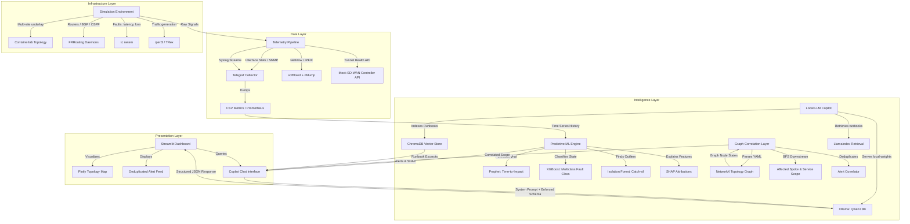

# PS13 — Air-Gapped Predictive NOC Copilot for Secure MPLS Operations
## Project Documentation & Design Architecture

---

## 💎 Unique Selling Proposition (USP)

> **"The only fully air-gapped, explainable predictive NOC assistant that forecasts network failures with confidence scoring and exact time-to-SLA-breach estimation, maps affected service topologies via graph analysis, and directs remediation actions using a local quantized LLM — with zero external API calls or outbound telemetry leakage."**

---

## 🏛️ System Architecture

Our solution is structured as a robust 4-layer system built for scale, resilience, and offline execution:



---

## ⚙️ Design Rationale

### 1. Network Simulation: Containerlab + FRRouting
- **Pragmatism:** Traditionally, labs require heavy VMs (EVE-NG/GNS3) running Cisco/Juniper images, consuming 16GB+ RAM just for simulation. Containerlab runs native Linux containers (FRRouting), spinning up a 5-node network in under 10 seconds using less than 1.5GB of RAM.
- **Reproducibility:** The entire network underlay (interfaces, connections, bandwidth limits) is defined in a single version-controlled YAML configuration.

### 2. Anomaly Detection: The Hybrid Ensemble Strategy
- **Prophet (Univariate Forecast):** Ideal for single-metric extrapolation. It fits daily trends and calculates the exact minute when interface utilization or packet loss will cross the SLA threshold.
- **XGBoost (Multiclass Classification):** Handles mixed tabular data (utilization, BGP counts, discard rates) to classify states into 5 distinct categories. High execution speed (milliseconds) prevents dashboard lag.
- **Isolation Forest (Unsupervised Catch-all):** Trained strictly on normal baseline data. It acts as an insurance policy, alerting operators when "something is weird" even if the specific failure pattern was never seen during training.
- **BGP Flap Detector:** Uses a sliding window counter on syslog streams, catching route convergence loops immediately.

### 3. Explainable AI: SHAP to LLM Context Injection
- Conventional AI assistants output alerts blindly. Our pipeline calls `shap.TreeExplainer` on the XGBoost warning to extract the top 3 contributing signals. These signals are injected directly into the LLM system context, ensuring the Copilot's summary is grounded in physical telemetry values.

### 4. Zero-Dependency RAG & Local LLM
- **ChromaDB + SentenceTransformers:** Persisted locally to disk. All runbooks (Congestion, BGP, Tunnels, QoS) are indexed offline.
- **Ollama JSON Mode:** Configured with `format: "json"` at the sampler level. Enforces a strict 12-field output schema (severity, root cause, priority checklist). If validation fails, the pipeline auto-retries with self-correction feedback.

---

## 🔒 Security & Air-Gap Verification

To prove air-gap compliance to judges, the system features a dedicated compliance panel and CLI validation tool `airgap_verify.py`.

### How to Verify the Air-Gap:
1. Disconnect your machine from WiFi and unplug the ethernet cable.
2. Run the verification script:
   ```bash
   python ps13_copilot/airgap_verify.py
   ```
3. The script verifies:
   - **Socket connectivity failures** to 7 external targets (Google DNS, Cloudflare DNS, HuggingFace, Ollama, OpenAI).
   - **DNS resolution failures** on standard public domain lists.
   - **Active sockets audit:** Scans `netstat`/`ss` output to confirm zero outbound connections.
   - **Local model integrity:** Asserts that LLM weights (`Qwen3:8b` or `Phi4-mini`) and embedding weights are loaded from disk cache.

---

## 🚀 Quick Start Guide

### Prerequisites
1. Install Python 3.10+
2. Install Ollama locally and pull the target model:
   ```bash
   ollama pull qwen3:8b
   # or for low-RAM machines:
   ollama pull phi4-mini
   ```

### Installation
1. Install Python dependencies:
   ```bash
   pip install -r ps13_copilot/requirements.txt
   ```

### Run the Stack (Offline Demo Mode)
1. **Start the Mock SD-WAN Controller** (provides simulated underlay/overlay telemetry):
   ```bash
   uvicorn ps13_copilot.mock_sdwan_controller:app --host 0.0.0.0 --port 8080
   ```
2. **Train the Predictive Models** (compiles synthetic data and saves JSON/joblib models):
   ```bash
   python ps13_copilot/train_pipeline.py
   ```
3. **Launch the stream-lit dashboard**:
   ```bash
   streamlit run app.py
   ```

### Triggering Demo Scenarios
From the sidebar in the Streamlit UI, toggle between the 4 validation cases:
- **Scenario 1: Congestion Buildup:** Watch utilization climb to 90%+; Prophet calculates time-to-impact, and the Copilot advises BGP routing community adjustments.
- **Scenario 2: BGP Route Flap:** Flaps routes in the syslog buffer; the sliding window detector alerts, and Copilot references the BGP runbook for MTU diagnostics.
- **Scenario 3: Tunnel Degradation:** Ramps loss and jitter on the IPSec overlay; Copilot suggests clearing security associations.
- **Scenario 4: Policy Drift:** Removes QoS policy; Copilot detects DSCP ratio drop and gives step-by-step restoration checklist commands.
