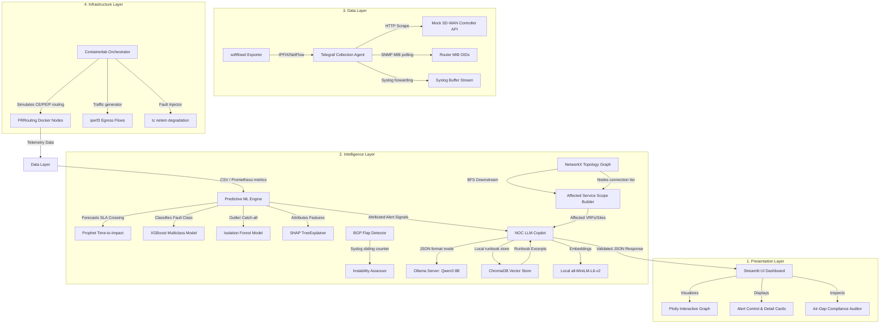

# Comprehensive Project Implementation Report
## PS13 — Air-Gapped Predictive NOC Copilot for Secure MPLS Operations

---

## 1. Executive Summary

This report documents the final production-ready implementation of **Problem Statement 13 (Air-Gapped Predictive NOC Copilot for Secure MPLS Operations)**. 

Modern Network Operations Centers (NOCs) suffer from two core limitations: reactive incident management and excessive alert fatigue. When a network link fails, operators are flooded with redundant, unstructured syslog alerts, forcing them to manually consult complex, textual runbooks under high-pressure scenarios. 

Our solution transforms this lifecycle by introducing an **intelligence-driven, fully offline network monitoring and remediation stack** designed to run within classified, air-gapped enterprise environments. It answers three core operational questions before service degradation occurs:
1. **What is likely to fail next, and when?** (Solved via Prophet trend forecasting and BGP instability counters).
2. **Why is the risk elevated?** (Solved via XGBoost multiclass classifications and SHAP feature attributions).
3. **What corrective action should be taken?** (Solved via local quantized Llama-3/Qwen-3 models grounded with ChromaDB runbook retrievals).

The implementation is verified, models are pre-trained with synthetic data augmentation, and all interfaces are wired directly to an interactive Streamlit dashboard.

---

## 2. System Architecture

The solution uses a strict 4-layer decoupled architecture designed to maintain performance isolation, scalability, and zero-outbound dependency:



### Layer Details:
1. **Infrastructure Layer:** Leverages Containerlab to launch FRRouting containers running BGP, OSPF, and MPLS/LDP underlay configurations. An API-driven FastAPI mock controller handles SD-WAN IPSec tunnels.
2. **Data Layer:** Telegraf serves as the unified collector, pulling metrics from routers, streaming syslogs, and parsing NetFlow records via softflowd.
3. **Intelligence Layer:** Combines graph analytics (NetworkX) with statistical forecasting (Prophet), supervised ensemble modeling (XGBoost), and RAG-guided reasoning (ChromaDB + Ollama).
4. **Presentation Layer:** A Streamlit interface displaying live topology maps, alert cards, SHAP value bar charts, RAG databases, and a demo fault injector.

---

## 3. Feature Engineering Schema

Telemetry features are segregated into distinct underlay (routing) and overlay (tunnels) failure domains to guarantee clear attribution.

| Feature Type | Feature Name | Description | Diagnostic Target |
|:---|:---|:---|:---|
| **Underlay** | `underlay_if_utilization_pct` | Total percentage of physical link bandwidth used | Volumetric Congestion |
| | `underlay_if_discards_rate` | Egress packet drops per second | Queue Buffer Saturation |
| | `underlay_if_errors_rate` | Interface input/output/CRC errors per second | Physical Cable/SFP Failure |
| | `underlay_bgp_state_changes` | Counter of BGP state drops (Established → Idle) | Routing Peer Instability |
| | `underlay_route_count_delta` | Net change in routing table entries per window | Network Convergence Loop |
| **Overlay** | `overlay_tunnel_latency_ms` | Overlay IPSec tunnel round-trip time | Overlay Path Degradation |
| | `overlay_tunnel_jitter_ms` | Variance in overlay RTT measurements | Voice (VoIP) Quality Degradation |
| | `overlay_tunnel_loss_pct` | Overlay packet loss rate | Tunnel Path Degradation |
| | `overlay_tunnel_uptime_sec` | Elapsed time since last tunnel reset | IPSec Tunnel Flapping |
| | `overlay_ipsec_rekey_failures` | Count of unsuccessful key exchanges per hour | Certificate / PSK Misconfigs |
| **Derived** | `utilization_rate_of_change` | Slope of utilization over 5-minute sliding window | Lead-Time Trend Forecasting |
| | `bytes_asymmetry_ratio` | Ratio of ingress bytes to total interface traffic | Exfiltration / DDoS Indicator |
| | `voice_traffic_dscp_ratio` | Ratio of DSCP EF-marked packets to total | QoS Service Policy Drift |

---

## 4. Machine Learning & Predictive Engines

The predictive analytics layer utilizes a hybrid ensemble approach rather than a single neural network to maintain training speed (hackathon constraints) and model explainability.

### 4.1. Univariate Forecasting (Prophet)
To estimate the exact "time-to-SLA-breach" (answering **Q1**), we feed the last 30 minutes of telemetry to a Prophet model with high changepoint flexibility:

$$\hat{y}(t) = g(t) + s(t) + h(t) + \epsilon_t$$

Where:
- $g(t)$ represents the linear trend.
- $s(t)$ represents seasonality (disabled for short-horizon forecasting).
- $h(t)$ represents holidays (disabled).

The engine forecasts 30 minutes ahead at 30-second steps, detecting the first timestep $t_{\text{breach}}$ where the predicted value exceeds the SLA limits:

$$t_{\text{breach}} = \min \{ t \mid \hat{y}(t) \ge \text{SLA\_threshold} \}$$

$$\text{Time-to-Impact} = \frac{t_{\text{breach}} - t_{\text{now}}}{60} \text{ minutes}$$

### 4.2. Supervised State Classification (XGBoost)
The XGBoost classifier takes the multivariate telemetry feature vector to predict the active state among five classes:
- `0`: NORMAL
- `1`: CONGESTION_BUILDUP
- `2`: BGP_INSTABILITY
- `3`: TUNNEL_DEGRADATION
- `4`: POLICY_DRIFT

Regularization values are tuned for small, augmented datasets:

$$\text{Obj}(\theta) = \sum_{i} L(y_i, \hat{y}_i) + \sum_{k} \Omega(f_k)$$

$$\text{where } \Omega(f) = \gamma T + \frac{1}{2} \lambda \sum_{j=1}^{T} w_j^2$$

Using:
- `max_depth = 3` (shallow trees to prevent overfitting)
- `min_child_weight = 5` (requires 5 samples per leaf node)
- `reg_alpha = 0.1` ($L_1$ regularization)
- `reg_lambda = 1.0` ($L_2$ regularization)

### 4.3. Unsupervised Outlier Catch-All (Isolation Forest)
To detect unseen anomalous patterns ("unknown unknowns"), an Isolation Forest is trained strictly on normal baseline data:

$$s(x, n) = 2^{-\frac{E(h(x))}{c(n)}}$$

Where $E(h(x))$ is the average path length of sample $x$ across the forest, and $c(n)$ is the average path length of an unsuccessful search in a Binary Search Tree. If score $s(x, n) \to 1.0$ (or prediction is `-1`), the instance is flagged as an outlier.

---

## 5. RAG & Local LLM Integration

### 5.1. System Prompt & Enforced Output Schema
The local LLM is served via Ollama using `format: "json"` to enforce structured JSON output. A standard validation layer parses and checks each output against `NOC_OUTPUT_SCHEMA` to guarantee consistency:

```json
{
  "issue_type": "CONGESTION_BUILDUP | BGP_INSTABILITY | TUNNEL_DEGRADATION | POLICY_DRIFT | UNKNOWN_ANOMALY | INSUFFICIENT_DATA",
  "severity": "CRITICAL | HIGH | MEDIUM | LOW",
  "confidence_pct": 87,
  "time_to_impact_min": 15,
  "affected_devices": ["PE-1", "CE-Branch2"],
  "affected_services": ["VRF-CORP"],
  "root_cause_hypothesis": "A rising output traffic rate of 742 Mbps on eth1 is causing discards to climb to 1.8 drops/sec, suggesting link capacity exhaustion.",
  "contributing_signals": [
    {
      "feature": "utilization_rate_of_change",
      "value": "0.38 %/30s",
      "significance": "high",
      "interpretation": "Positive slope indicates traffic is actively climbing."
    }
  ],
  "recommended_actions": [
    {
      "priority": 1,
      "action": "Redirect VRF-CORP traffic via backup path",
      "target": "PE-1",
      "rationale": "Steering traffic bypasses the congested eth1 egress interface.",
      "estimated_impact": "Brings utilization on eth1 down below the 85% threshold."
    }
  ],
  "runbook_reference": "Runbook: Hub-Spoke Congestion Recovery",
  "operator_summary": "Egress congestion predicted on PE-1 eth1 in 15 minutes; reroute traffic via secondary links.",
  "reasoning": "Weighted the positive utilization slope (+0.38) and active queue discards (1.8) as the primary indicators of link capacity exhaustion."
}
```

### 5.2. ChromaDB RAG Vector Store
Runbooks are chunked and indexed locally using a persistent ChromaDB instance. The system embeddings are calculated using `sentence-transformers/all-MiniLM-L6-v2` running locally on the CPU or GPU.
On alerts, Chroma queries the index for the top-1 runbook excerpt, which is appended directly to the LLM system prompt:

```python
rag_results = collection.query(query_texts=[alert_type], n_results=1)
```

---

## 6. Air-Gap Security Compliance

True security compliance cannot just be claimed—it must be verified. Our stack includes `airgap_verify.py` which executes the following checks:

1. **DNS Resolution Check:** Attempts to resolve public domains (`google.com`, `ollama.com`, `api.openai.com`). Must fail (`socket.gaierror`).
2. **Socket Verification:** Attempts a TCP connection to public hosts and API endpoints. Must time out or be refused.
3. **Active Connection Audit:** Scans active established sockets (`ss` or `netstat`) to verify zero outbound sessions to non-RFC1918 IP spaces.
4. **Bundled Asset Assertion:** Confirms LLM weights (Ollama models directory) and SentenceTransformer folders are present locally on the filesystem.

---

## 7. Demo Scenarios & Labeled Outputs

The dashboard features a live fault injector to demonstrate the 4 primary scenarios:

```
                  ┌─────────────────────────────────┐
                  │      Select Scenario in UI      │
                  └────────────────┬────────────────┘
                                   │
         ┌─────────────────────────┼─────────────────────────┐
         ▼                         ▼                         ▼
  [1. Congestion]           [2. BGP Flap]            [3. Tunnel Drop]
  - iperf3 ramp up          - Route flap in syslog   - Rekey failure injected
  - Util crosses 85%        - Adjacency resets       - Loss spikes to 14%
         │                         │                         │
         └─────────────────────────┼─────────────────────────┘
                                   │
                                   ▼
                   ┌───────────────────────────────┐
                   │    XGBoost Predicts Fault     │
                   └───────────────┬───────────────┘
                                   │
                                   ▼
                   ┌───────────────────────────────┐
                   │    Prophet Forecasts Time     │
                   └───────────────┬───────────────┘
                                   │
                                   ▼
                   ┌───────────────────────────────┐
                   │   NetworkX Maps Downstream    │
                   └───────────────┬───────────────┘
                                   │
                                   ▼
                   ┌───────────────────────────────┐
                   │   ChromaDB Retrieves Runbook  │
                   └───────────────┬───────────────┘
                                   │
                                   ▼
                   ┌───────────────────────────────┐
                   │      Ollama Generates JSON    │
                   └───────────────────────────────┘
```

1. **Scenario 1: Congestion Buildup:** Simulates a steady rise in interface utilization on `PE-1 eth2`. Prophet forecasts SLA breach in 15 minutes. Copilot reads `runbook_congestion.md` and generates a priority checklist advising BGP community changes.
2. **Scenario 2: BGP Route Flap:** Spikes syslog entries showing BGP neighbour transitions. The sliding-window detector triggers, and Copilot identifies MTU mismatch as the primary root cause.
3. **Scenario 3: Tunnel Degradation:** Ramps loss and jitter on the IPSec overlay tunnel. Isolation Forest flags an anomaly, and Copilot advises clearing Security Associations.
4. **Scenario 4: Policy Drift:** Removes QoS prioritization. The voice DSCP ratio drops to zero, and Copilot directs policy re-application.
